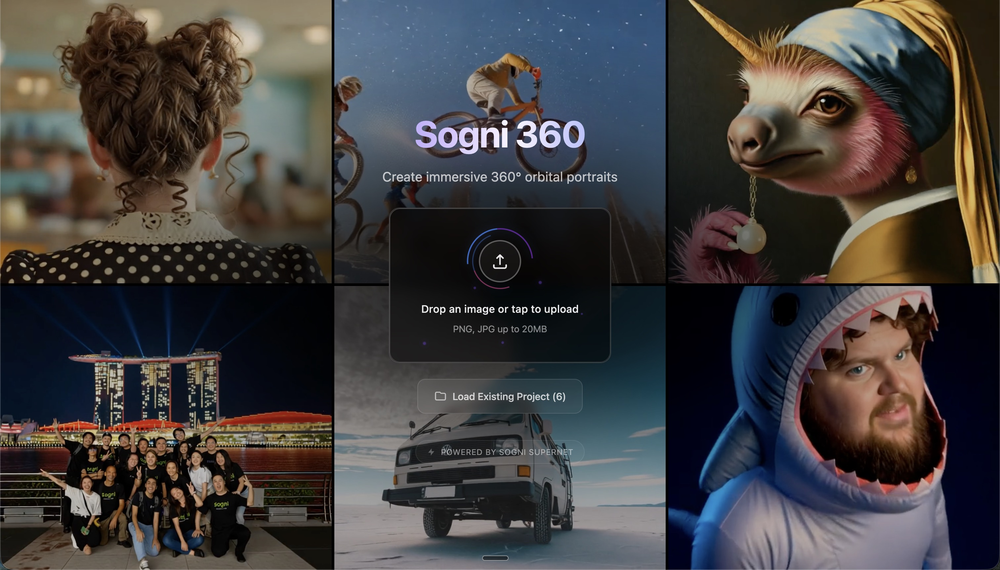

# Sogni 360

[](LICENSE)
[](CONTRIBUTING.md)

Create stunning **360° orbital videos** with cutting-edge AI. The ultimate tool for storytellers—simple and intuitive with powerful options for pros. Upload any image, select camera angles, and generate seamless rotating videos with smooth AI transitions. Powered by **Qwen Image Edit 2511** and the **Multiple Angles LoRA**. No downloads or GPU required.

**Popular Use Cases:**
- **Action Sports** - BMX, skateboarding, surfing, motocross freeze-frames from every angle
- **Vehicles** - Cars, motorcycles, bikes with cinematic camera sweeps
- **Travel & Social Media** - Cinematic travel videos perfect for Instagram, TikTok, YouTube
- **Portraits & Characters** - Classic 360° character turnarounds
- **Architecture & Interiors** - Room tours, real estate, 3D space visualization
- **Product Photography** - E-commerce spins, detailed product views
- **Storytelling** - Scene exploration, visual narratives with perspective shifts

**Key Capabilities:**
- 🔄 **96 Camera Angles** via Multiple Angles LoRA (8 azimuths × 4 elevations × 3 distances)
- 🎬 **Seamless Transitions** with AI-generated video segments between angles
- 📱 **Full-Screen Immersive** experience on desktop and mobile
- ⚡ **Batch Generation** of all angles in parallel
- 🎯 **Smart Presets** for common orbital patterns (360° rotation, zoom montage, dynamic angles)

This is a demo "SuperApp" powered by the Sogni Client SDK, showcasing the [Sogni Supernet](https://sogni.ai) dePIN creative AI inference network. Fork it, learn from it, or build your own Sogni-powered application.

Live demo → **https://360.sogni.ai**

<div align="center">
  
</div>

---

## ✨ Features

### 🔄 Camera Angle Generation

**Multiple Angles LoRA** with Qwen Image Edit 2511 enables re-rendering any image from any perspective:

| Dimension | Options | Description |
|-----------|---------|-------------|
| **Azimuth** | 8 positions | Front, Front-Right, Right, Back-Right, Back, Back-Left, Left, Front-Left |
| **Elevation** | 4 heights | Low-angle (-30°), Eye-level (0°), Elevated (30°), High-angle (60°) |
| **Distance** | 3 zoom levels | Close-up, Medium, Wide |

**= 96 total camera angle combinations**

### 🎯 Preset Templates

Quick-start templates for common 360° experiences:

| Preset | Angles | Description |
|--------|--------|-------------|
| **Simple Zoom Out** | 2 | Original + zoomed out view |
| **Zoom Out 360** | 5 | Full rotation at eye level |
| **Zoom Montage** | 7 | Dynamic angles with varied heights |
| **Portrait Trio** | 4 | Classic angle variations |

### 🎬 Video Transitions

Generate smooth AI video transitions between adjacent waypoints:

| Quality | Model | Steps |
|---------|-------|-------|
| **Fast** | LightX2V | 4 |
| **Balanced** | LightX2V | 8 |
| **High Quality** | Wan 2.2 14B | 20 |
| **Pro** | Wan 2.2 14B | 30 |

Resolutions: 480p, 580p, 720p

### 📱 Immersive Experience

- **Full-screen, no-scrollbar** design
- **Click/tap zones** for navigation (left/center/right)
- **Swipe gestures** on mobile
- **Keyboard shortcuts** (A/D, arrows, Space, E, Escape)
- **Auto-play** mode cycles through all angles
- **Auto-hide UI** for distraction-free viewing

---

## 🚀 Quick Start

### Prerequisites

- Node.js 18+
- npm 9+
- Sogni account with API credentials ([sign up](https://app.sogni.ai))

### Installation

```bash
# Clone the repository
git clone https://github.com/AISuperApp/sogni-360.git
cd sogni-360

# Install dependencies (includes server)
npm install

# Configure backend
cp server/.env.example server/.env
# Edit server/.env with your Sogni credentials
```

### Configuration

Edit `server/.env`:

```env
SOGNI_USERNAME=your_sogni_username
SOGNI_PASSWORD=your_sogni_password
SOGNI_ENV=production
PORT=3002
```

### Development

```bash
# Terminal 1: Start backend API
cd server && npm run dev

# Terminal 2: Start frontend
npm run dev
```

Open http://localhost:5180 (or https://360-local.sogni.ai if using nginx proxy)

### Production Build

```bash
npm run build
```

---

## 🏗️ Architecture

```
┌─────────────────┐     ┌──────────────────┐     ┌─────────────────┐
│  React Frontend │────▶│  Express Backend │────▶│  Sogni SDK      │
│  (Vite + TS)    │     │  (Node.js)       │     │  (WebSocket)    │
└─────────────────┘     └──────────────────┘     └─────────────────┘
        │                        │
        │ SSE Progress           │ Single Global Client
        ◀────────────────────────┘
```

### Tech Stack

**Frontend:**
- React 18 + TypeScript
- Vite for bundling
- Tailwind CSS for styling
- Context API for state management

**Backend:**
- Express.js
- Sogni Client SDK
- Server-Sent Events (SSE) for progress

### Key Directories

```
sogni-360/
├── src/
│   ├── components/          # React components
│   │   ├── Sogni360Container.tsx   # Main orchestrator
│   │   ├── WaypointEditor.tsx      # Angle selection UI
│   │   ├── Sogni360Viewer.tsx      # Image/video viewer
│   │   └── shared/                 # Reusable components
│   ├── services/            # API clients, generators
│   ├── context/             # React Context providers
│   ├── constants/           # Camera angles, video settings
│   └── types/               # TypeScript interfaces
├── server/
│   ├── index.js             # Express server
│   ├── routes/sogni.js      # API endpoints
│   └── services/sogni.js    # SDK wrapper
└── public/                  # Static assets
```

---

## 🎮 Usage

### Basic Workflow

1. **Upload** any image (drag-drop or click)
2. **Select angles** using presets or custom configuration
3. **Generate** all angles in batch (parallel processing)
4. **Review** and regenerate any unsatisfactory angles
5. **Generate transitions** between adjacent waypoints
6. **Play** the immersive 360° experience
7. **Export** as video loop

### Keyboard Shortcuts

| Key | Action |
|-----|--------|
| `A` / `←` | Previous angle |
| `D` / `→` | Next angle |
| `Space` | Toggle auto-play |
| `E` | Toggle angle editor |
| `Escape` | Close panels |

### Waypoint Types

- **Regular waypoints**: Generated via AI from the source image
- **Original waypoints**: Use the source image directly (no generation cost)

---

## 🔧 Configuration

### Environment Variables

**Frontend** (`.env.local`):
```env
VITE_SOGNI_APP_ID=sogni-360
VITE_SOGNI_ENV=production
```

**Backend** (`server/.env`):
```env
SOGNI_APP_ID=sogni-360
SOGNI_USERNAME=your_username
SOGNI_PASSWORD=your_password
SOGNI_ENV=production
PORT=3002
NODE_ENV=development
CLIENT_ORIGIN=https://360-local.sogni.ai
COOKIE_DOMAIN=.sogni.ai
```

### Local Development with HTTPS

For full functionality (cookies, OAuth), use nginx to proxy:
- `https://360-local.sogni.ai` → `localhost:5180`
- `https://360-api-local.sogni.ai` → `localhost:3002`

See [Sogni Photobooth nginx setup](https://github.com/AISuperApp/sogni-photobooth/tree/main/scripts/nginx) for reference.

---

## 📚 API Reference

### Backend Endpoints

| Method | Endpoint | Description |
|--------|----------|-------------|
| `GET` | `/health` | Health check |
| `GET` | `/api/sogni/status` | SDK connection status |
| `POST` | `/api/sogni/generate-angle` | Generate single camera angle |
| `POST` | `/api/sogni/estimate-cost` | Estimate generation cost |
| `GET` | `/sogni/progress/:projectId` | SSE progress stream |
| `POST` | `/api/sogni/disconnect` | Disconnect SDK |

### SSE Events

```typescript
type: 'connected' | 'queued' | 'started' | 'progress' | 'completed' | 'error'
```

The `completed` event contains `imageUrls: string[]` with result URLs.

---

## 🤝 Contributing

We welcome contributions! Please see [CONTRIBUTING.md](CONTRIBUTING.md) for guidelines.

### Development Commands

```bash
npm run dev          # Start frontend dev server
npm run build        # Production build
npm run lint         # ESLint check
npm test             # Run Jest tests
npm run test:watch   # Jest watch mode
```

---

## 📄 License

MIT License - see [LICENSE](LICENSE) for details.

---

## 🔗 Related Projects

- **[Sogni Photobooth](https://github.com/AISuperApp/sogni-photobooth)** - Full-featured AI media generation suite
- **[Sogni Client SDK](https://github.com/AISuperApp/sogni-client)** - Official Sogni Supernet client
- **[Sogni API Docs](https://docs.sogni.ai)** - API documentation

---

## 💬 Support

- **Discord**: [Sogni Community](https://discord.gg/sogni)
- **Issues**: [GitHub Issues](https://github.com/AISuperApp/sogni-360/issues)
- **Email**: support@sogni.ai

---

<div align="center">
  <strong>Built with ❤️ by the Sogni Team</strong>
  <br>
  <a href="https://sogni.ai">sogni.ai</a> · <a href="https://app.sogni.ai">app.sogni.ai</a> · <a href="https://photobooth.sogni.ai">photobooth.sogni.ai</a>
</div>
